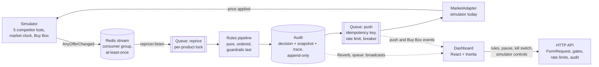
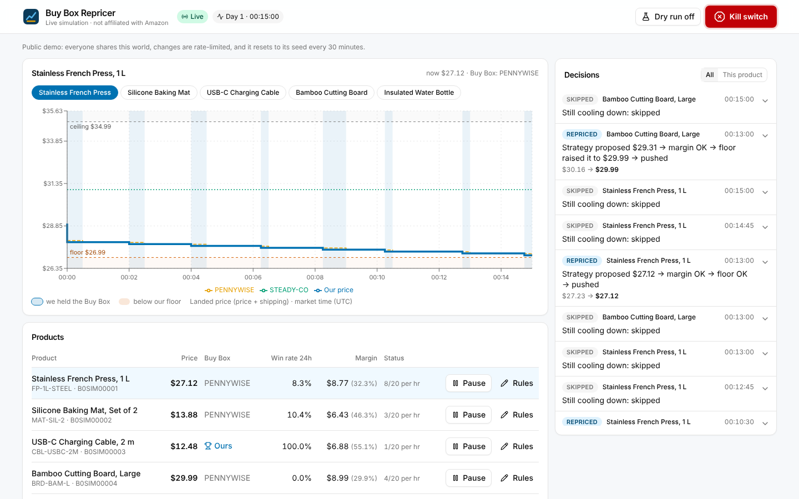
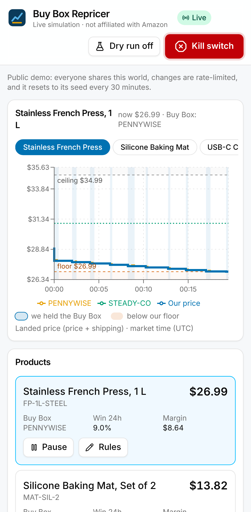
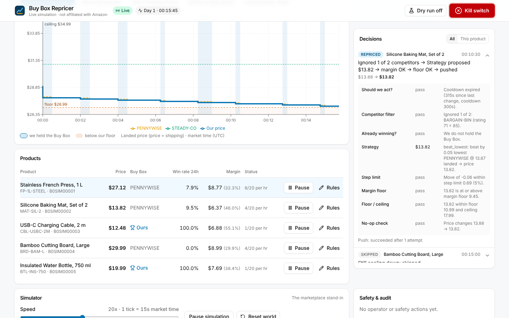
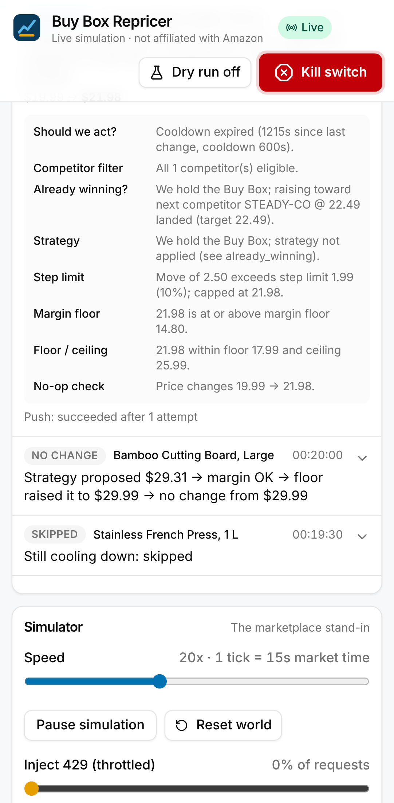
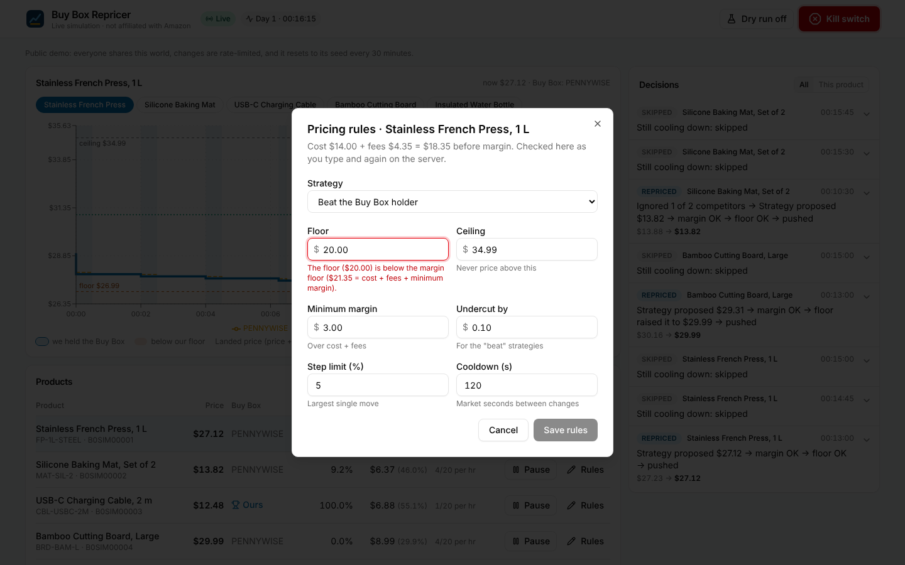
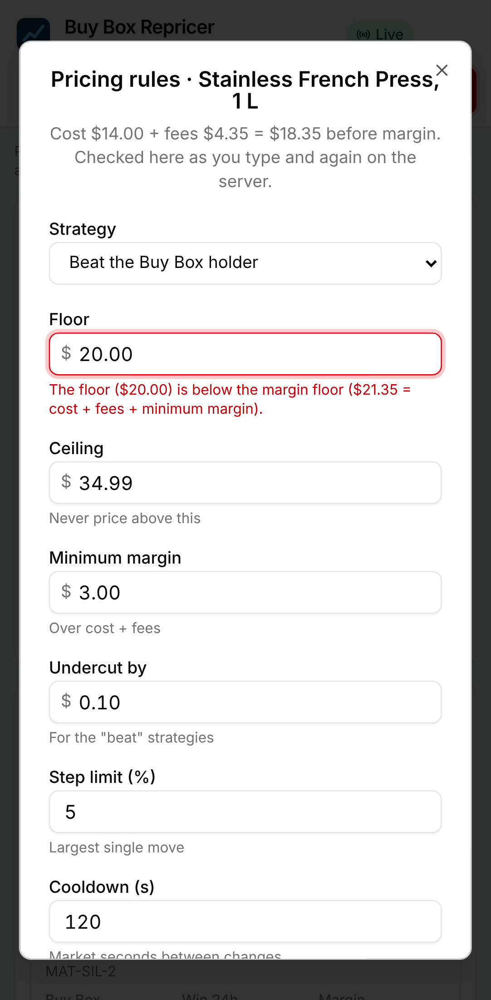
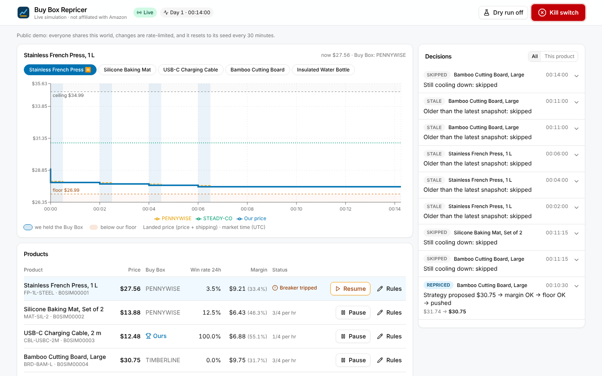
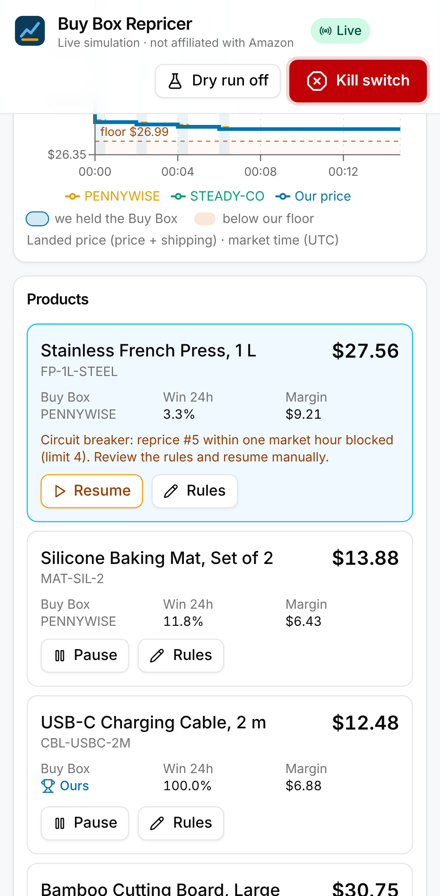

# Buy Box Repricer

**The problem.** On a big marketplace, several sellers list the same product, and one of them
wins the "Buy Box", the default Add to Cart button that takes most of the sales. Competitors
change their prices all day, often with bots. A seller who reprices by hand loses the box within
minutes. A seller who reprices with a careless bot either races to the bottom or prices
themselves at a loss.

This project is a repricer that fights for the Buy Box without doing either. It reacts to every
competitor change, decides a new price through a small, ordered, unit-tested rules pipeline, and
pushes it. It never goes below a floor, a margin floor or a ceiling, and it explains every
decision in plain language. It runs against a **simulated marketplace** with five competitor
bots, so you can watch it work without a seller account.

- **Live demo:** https://buybox-repricer-demo.onrender.com/ (hosting notes: [docs/hosting.md](docs/hosting.md)).
  It sleeps when nobody is watching, so the first load takes about a minute.
- **Instant replay (no server):** https://rdbagwell.github.io/buybox-repricer/ 


_Recorded with Playwright from a real local run (`tests/e2e/capture.spec.ts`), not staged._

> **Not affiliated with Amazon.** This is an independent portfolio project. "Buy Box",
> ASIN-style ids and the shape of the API boundary are used descriptively. It uses no Amazon
> logos or trade dress. The simulator's Buy Box algorithm is an **approximation**, because the
> real one is private.

## Contents

- [Backstory: from MWS to SP-API](#backstory-from-mws-to-sp-api)
- [The loop](#the-loop)
- [What to look at (for reviewers)](#what-to-look-at-for-reviewers)
- [Run it](#run-it)
- [Key decisions](#key-decisions)
- [The Buy Box approximation and its limits](#the-buy-box-approximation-and-its-limits)
- [The rules pipeline](#the-rules-pipeline)
- [The dashboard](#the-dashboard)
- [Safety](#safety)
- [Tests](#tests)
- [Stretch goals](#stretch-goals)
- [Reference: layout and CLI](#reference-layout-and-cli)

## Backstory: from MWS to SP-API

Early in my career, my boss at the time asked me to build an Amazon repricer for his store. It used
Amazon's MWS API to find which competitor held the Buy Box on products we also sold, compared their
price to ours, and adjusted our price to be competitive enough to win the Buy Box back. Every product
had a floor and a ceiling, so no matter what competitors did, the repricer would never price us
below what we could afford or above what made sense.

That code belonged to the company, and MWS has since been retired in favor of the Selling Partner
API. This project is a clean-room rebuild of the same idea, 12 years later: event-driven instead of
polling, with the pricing rules isolated and tested, and a simulated marketplace so anyone can run it
without a seller account.

Amazon's original seller API, MWS, was retired in favour of the Selling Partner API (SP-API).
SP-API moved authorisation to Login with Amazon (LWA) tokens, split pricing reads (the Product
Pricing API) from listing writes (the Listings Items API), and delivers offer changes as
`ANY_OFFER_CHANGED` notifications to an SQS queue instead of being polled. This project is
shaped by that boundary:

- the repricer only sees a `MarketAdapter` modelled on those operations;
- notifications arrive at-least-once from a queue;
- every request respects a per-operation token-bucket quota.

## The loop



A competitor bot changes its price, and the simulator publishes a notification. The listener
queues a decision for that product, and the pure pipeline decides from a snapshot. The decision,
its input and its rule-by-rule trace are written before anything else happens. If the price
should change, a push job sends it through the adapter, with an idempotency key, inside the rate
limit and past the circuit breaker. The dashboard hears every step over WebSockets.

## What to look at (for reviewers)

| If you have…                  | Look at                                                                                                                                                                                                                                                                                                    |
| ----------------------------- | ---------------------------------------------------------------------------------------------------------------------------------------------------------------------------------------------------------------------------------------------------------------------------------------------------------- |
| 10 seconds                    | The GIF above, or the replay: a price war already under way, with every decision explained.                                                                                                                                                                                                                |
| 5 minutes                     | Open a decision in the feed to read its plain-language trace. Then edit the French Press rules: type a floor below the margin floor and watch the client refuse it, then the server, with the same message. Then flip the kill switch.                                                                     |
| 15 minutes                    | [`app/Repricer/Rules`](app/Repricer/Rules), the pure pipeline. [`Pipeline.php`](app/Repricer/Rules/Pipeline.php) refuses to be built with the guardrails anywhere but last. Then [`tests/Unit/Rules`](tests/Unit/Rules), which includes the property tests.                                                |
| Concurrency                   | [`RepriceJob`](app/Repricer/Jobs/RepriceJob.php), [`ProductLock`](app/Repricer/Jobs/ProductLock.php) and [`PricePusher`](app/Repricer/Outbound/PricePusher.php): unique `(product, event)`, separate decision and push locks, supersession, idempotency keys.                                              |
| Safety                        | [`RepriceRateBreaker`](app/Repricer/Safety/RepriceRateBreaker.php) and [`CircuitBreakerTest`](tests/Feature/Dashboard/CircuitBreakerTest.php). Then [`AuthorizationTest`](tests/Feature/Dashboard/AuthorizationTest.php), which runs every mutating route in both modes, and [`SECURITY.md`](SECURITY.md). |
| The whole system under stress | [`AllBotsSimulationTest`](tests/Simulation/AllBotsSimulationTest.php): 400 ticks, five bots plus an extra Chaos bot, 15% injected 429s and 10% 503s. Every guardrail must hold and no decision may be duplicated.                                                                                          |
| The front end                 | [`resources/js/repricer`](resources/js/repricer): one `DataSource` interface with a live implementation (API + Reverb) and a replay implementation, so the same components render both.                                                                                                                    |

## Run it

### Everything in Docker

```bash
make up                          # postgres, redis, php-fpm, nginx, horizon, reverb, listener, scheduler, simulator
open http://localhost:8080       # the dashboard (demo mode: no login, shared world)
make sim                         # or drive the world from the CLI: 500 ticks, seed 42, 100x
make trace SKU=FP-1L-STEEL       # latest decisions with their full rule traces
make test                        # Pest inside the stack
make demo-reset                  # rebuild the world from its seed (the hosted demo does this every 30 min)
```

`make up` migrates, seeds and primes a world with a price war already running. The simulator
daemon only ticks while a dashboard is open. A visible tab sends a heartbeat every 30 s.
`.env.example` ships with `DEMO_MODE=true`. Set it to `false` and every page and action needs a
logged-in user, with broadcasts on a private channel.

### Without Docker

You need PHP 8.3 with `pdo_pgsql` and `phpredis`, Postgres 16, Redis 7 and Node 22.

```bash
cp .env.example .env && composer install && npm ci && php artisan key:generate
php artisan migrate --seed && php artisan demo:prime --if-fresh && npm run build
php artisan reverb:start --port=8090 &
php artisan queue:work redis --queue=reprice,push,broadcasts,default &
php artisan repricer:listen &
php artisan sim:daemon --idle-after=120 &
php artisan serve                                   # http://127.0.0.1:8000
```

Set `REVERB_CLIENT_PORT=8090` in `.env` when the browser talks to Reverb directly rather than
through nginx.

### Simulate, trace, record

```bash
php artisan sim:run --ticks=500 --seed=42 --speed=100   # prints every Buy Box change
php artisan repricer:trace FP-1L-STEEL                  # decisions + rule traces + push attempts
php artisan sim:record --seed=42                        # re-record public/recordings/demo.json
npm run build:replay                                    # static replay → dist-replay/ (GitHub Pages)
```

The dashboard has the same simulator controls:

- a speed slider (1–100x; the public demo caps it at 50x);
- add and remove bots;
- a stockout per competitor;
- injected 429 and 503 rates;
- reset to seed.

### Test

```bash
vendor/bin/pest                              # PHP: needs Postgres + Redis (see "Tests")
npm test                                     # Vitest: money, rule validation, trace rendering, buffers
npx vp check && npm run types:check          # lint, format, TypeScript
npx playwright test --grep-invert @capture   # browser tests against a running stack (E2E_BASE_URL)
```

## Key decisions

**Push over poll.** The repricer never polls prices. It reacts to offer-change notifications,
delivered at-least-once through a Redis stream with a consumer group. That mirrors SP-API's
`ANY_OFFER_CHANGED` delivered to SQS: acknowledge after dispatch, redeliver after a visibility
timeout. One gap of a purely push-driven design is closed explicitly. An event skipped for
cooldown would never be revisited if the market then went quiet, so `CooldownSweeper`
re-decides from that decision's own audited snapshot once the cooldown expires, spending no
quota.

**Pure rules.** The pipeline (`App\Repricer\Rules`) takes a `PricingContext` and returns a
decision and a trace. It has no framework, no clock, no randomness and no I/O, and architecture
tests enforce that. Every rule is tested with hand-built contexts, and property tests run
thousands of seeded cases. The impure shell (jobs, locks, pushes) is thin and tested separately.

**Integer cents.** Money is integer cents everywhere:

- PHP: `App\Support\Money`;
- the database: a test fails any migration that uses float or decimal;
- JSON, broadcasts and the recording;
- TypeScript: `formatCents` and `parseMoney`, with integer arithmetic only.

It is formatted only at the UI edge. Percentages are basis points, and every division names its
rounding mode.

**Market time.** The simulator has its own clock (a tick is 15 s of market time). `--speed` only
changes how long a tick takes in real time. Cooldowns, the circuit breaker's hour, win rates and
every stored timestamp use market time from `MarketAdapter::now()`. A real adapter would return
the wall clock. Rate limits are the exception, because token buckets model real throughput.

**The idempotency key.** Each push carries `decision-<id>`. The adapter answers a replayed key
with the original result, and a decision with a finished push is never pushed again.
Decisions are unique on `(product_id, event_id)`, so a redelivered notification is recorded as a
duplicate delivery and never reprices twice.

**The lock strategy.** There are two per-product locks, one for decisions and one for pushes.
They are separate so a decision never waits on its own push, while an older price can never land
after a newer one. A newer decision supersedes a pending push, and stale events are recorded and
skipped.

**The circuit breaker.** More than N reprices in one **market** hour (default 20,
`REPRICER_BREAKER_MAX_PER_HOUR`) means the strategy is fighting something it shouldn't be. The
breaker:

- pauses the product;
- records the reason on it;
- writes a `breaker.tripped` audit row (actor `system`);
- blocks the push, which shows as **Blocked** in the feed.

It **never** resumes on its own. An operator resumes explicitly, which is acknowledged and
audited.

**Demo sandboxing.** The public demo is one shared world, rebuilt from its seed every 30 minutes
and on every boot, rather than a sandbox per visitor. Per-visitor worlds would multiply the
simulator and database load on a free 512 MB instance, and a shared world is always mid-war,
which is the point of the demo. Mutations are rate-limited per visitor. Speed, injected faults
and world size are capped on the server. Registration is off, so nothing outlives a reset. See
[docs/hosting.md](docs/hosting.md) and [SECURITY.md](SECURITY.md).

## The Buy Box approximation and its limits

`BuyBoxScorer` is deterministic and documented:

- offers rated below 80% are disqualified;
- effective price = landed price, −3% if marketplace-fulfilled, +1% per handling day beyond 2,
  so landed price dominates;
- the lowest effective price wins. **Ties go to the incumbent** (no flapping), otherwise the
  lowest landed price, then seller id.

**Limits.** The real algorithm is private and weighs far more: seller performance metrics,
account health, inventory depth, delivery promises, Prime eligibility, region, and probably a
rotation between near-equal offers. Nothing here should be read as how Amazon decides. The
approximation exists so the repricer has something consistent to fight over, and so tests can
pin behaviour such as "a tie keeps the incumbent".

## Other marketplaces (TikTok Shop, Facebook)

Not every marketplace has a Buy Box. The simulator also models an **open-listing** marketplace,
where every seller lists separately and what matters is our price rank among comparable
listings. The LED Ring Light sells there: its row shows an **Open listings** badge and our rank
("Cheapest of 3") instead of a Buy Box holder, and "beat the Buy Box holder" is refused for it.
The rules, guardrails and audit trail are the same. New products can be added on either kind.
[docs/marketplaces.md](docs/marketplaces.md) covers what would change for TikTok Shop and
Facebook, with sources.

## The rules pipeline

Each rule takes the context and the price proposed so far. It returns one of three verdicts:

- a **proposal** (a price and a reason);
- a **pass**;
- a **veto** (stop, with a reason).

Every verdict lands in the trace stored with the decision. The order is configured once, in
`DefaultPipeline`:

1. **should_act**: veto on the kill switch, a paused product, or cooldown (in market time).
2. **competitor_filter**: drop competitors below the rating threshold or above the
   handling-time limit.
3. **already_winning**: if we hold the Buy Box, never cut. Consider raising toward the next
   competitor's landed price minus the offset.
4. **strategy**: `beat_lowest` by X, `match_lowest`, or `beat_buybox` by X, all on **landed
   price** (price + shipping).
5. **step_limit**: cap a single move at `max_step_pct` of the current price (rounded down, at
   least 1 cent).
6. **margin_floor**: never below cost + fees + minimum margin. **Guardrail.**
7. **floor_ceiling**: clamp to the product's hard floor and ceiling. **Guardrail.**
8. **no_op**: veto when the final price equals the current one.

The competitor filter runs _before_ the strategy, because a strategy that has already priced
against an ineligible offer cannot be un-chased later. A test pins this order.

**Guardrails always run last among the price-shaping rules, as a tested invariant.** Every rule
declares a `Stage`. `Pipeline` refuses to be built if the stages are out of order or either
guardrail is missing, and it throws if a filter or final-stage rule proposes a price. As a last
line of defence, it vetoes any final price outside `[max(floor, margin floor), ceiling]`.

### Edge cases (all covered by tests)

| Situation                           | Behaviour                                                                                                                                                                |
| ----------------------------------- | ------------------------------------------------------------------------------------------------------------------------------------------------------------------------ |
| No competitors                      | `no_competition=hold` keeps the price; `raise_to_ceiling` heads for the ceiling (still step-limited).                                                                    |
| Every competitor filtered out       | Same as no competitors; the trace says they were filtered.                                                                                                               |
| Floor above every competitor        | The floor wins: we stay at the floor even if we lose the Buy Box.                                                                                                        |
| Margin floor above the ceiling      | Configuration error: vetoed, recorded as `config_error`, never priced. The same goes for floor > ceiling.                                                                |
| We're the only seller               | We hold the Buy Box, and the no-competition setting applies.                                                                                                             |
| Tie on landed price                 | The shared price is the reference: `beat_*` undercuts it, while `match_lowest` joins the tie, which the incumbent keeps (the Matcher bot's tests pin this).              |
| A competitor goes out of stock      | It drops out of the context. Holding the box, we raise toward the next competitor, step by step, and fight again when it returns (`tests/Simulation/SleeperTest.php`).   |
| Current price outside floor–ceiling | The guardrails move it into range even if that exceeds the step limit. This is the only way a move may exceed the step limit, and the property tests check exactly that. |

## The dashboard

React 19, Inertia and TypeScript on the Laravel starter kit, with Recharts for the chart and
Laravel Reverb for live updates.

- **Price chart per product.**
    - Our price is a bold line; bots are thin, dashed lines with labels.
    - Floor and ceiling bands; shading wherever we held the Buy Box.
    - A market-time axis and a legend.
    - The Okabe–Ito colour-blind-safe palette, plus dash patterns so colour is never the only cue.
- **Decision feed.**
    - Outcome badges: Repriced, Blocked, Push failed, No change, Skipped, Vetoed, Stale, Dry run.
    - Each row expands into a plain-language, rule-by-rule trace.
- **Product table.**
    - Price, Buy Box holder, 24h win rate in market time, and margin.
    - Reprices this hour against the breaker limit.
    - Pause and resume, where resuming needs an acknowledgement.
    - **Add product**: a form (title, SKU, cost, fees, shipping, starting price, the pricing
      rule and up to two competitor bots) that opens a new simulated listing; the repricer
      starts on it at once. Validated like the rule editor, on the client and the server.
    - **Archive**: products are archived, never deleted, because their decisions and audit
      trail are append-only. An archived product stops repricing and leaves the simulation;
      its history stays. **Restore** (under _Archived_) brings it back against the same
      competitor bots it had, which the archive's audit row records.
    - The rule editor: server validation in a FormRequest, mirrored on the client, and every
      change audited with before and after values.
- **Always-visible kill switch** with a confirmation, plus a dry-run toggle with a banner.
- **Live updates.** Decision, push, Buy Box, product and settings events arrive over Reverb
  into a bounded client buffer (150 decisions, 600 chart points per product). A dropped socket
  is shown, reconnects with backoff, and catches up from the API on return.
- **Responsive** down to 320 px, with empty and error states.

|                                  | Desktop                                       | Phone                                       |
| -------------------------------- | --------------------------------------------- | ------------------------------------------- |
| Mid price war                    |    |    |
| An expanded trace                |        |        |
| Rule editor refusing a bad floor |  |  |
| Circuit breaker tripped          |      |      |

All screenshots were captured by Playwright from real local runs. See
[docs/screenshots/README.md](docs/screenshots/README.md) for how.

**Replay mode** plays a recorded, seeded run through the same components, entirely in the
browser. The recording (`public/recordings/demo.json`) holds the exact broadcast payloads the
live system produced, tick by tick. `sim:record` runs the real simulator, repricer and pipeline
inside a transaction it rolls back, so the dev database is untouched. The replay is published
to GitHub Pages and loads instantly while the live demo wakes up, offering a link once the
server answers.

## Safety

- **Kill switch** and **dry run** live in `settings`; **pause** lives on `products`. Every
  decision and every push reads them fresh. They're available on the dashboard and through
  `repricer:switch` / `repricer:pause`.
- **Circuit breaker:** see [Key decisions](#key-decisions).
- **Audit:**
    - every decision (skips, vetoes, no-ops and stale events included) stores its input
      snapshot, the rule trace, old and new prices and the outcome;
    - every operator action (kill switch, dry run, pause and resume, rule change with before and
      after, simulator controls) and every breaker trip is written to `audit_log`;
    - the audit tables are **append-only**, enforced both by the models and by Postgres triggers
      that reject `UPDATE`/`DELETE`.
- **Web security:** gates on every route, FormRequest validation, rate limits, channel
  authorisation, no stack traces or SQL in responses, and secrets in the environment only. See
  [SECURITY.md](SECURITY.md).

## Tests

| Suite                                      | Covers                                                                                                                                                                                                                                                              |
| ------------------------------------------ | ------------------------------------------------------------------------------------------------------------------------------------------------------------------------------------------------------------------------------------------------------------------- |
| `tests/Unit/Rules`                         | Every rule with hand-built contexts; table-driven pipeline scenarios; the ordering invariant; **property tests** (seeded loops of 5,000 and 2,000 cases: within floor, ceiling and margin floor, within the step limit unless a clamp forces it, deterministic).    |
| `tests/Unit/Simulator`                     | Buy Box scoring, and each bot: Penny Pincher, Anchor, **Matcher** (ties, incumbent advantage), **Sleeper** (stockout and return), **Chaos** (seeded band, reaction rate). Also determinism.                                                                         |
| `tests/Feature/Simulator`                  | The database-backed runner matches the in-memory engine; seed reproducibility; the CLI.                                                                                                                                                                             |
| `tests/Feature/Repricer`                   | Decisions, duplicates, crash and retry, stale events, switches, the append-only audit, pushes under injected 429/503, rate limiting, the lock with a real worker, the listener and redelivery, cooldown rechecks.                                                   |
| `tests/Feature/Dashboard`                  | Authorisation on **every** mutating endpoint (operator and demo modes), rate limits, confirmations, caps, error hygiene; rule validation on the server and the audit diff; the **circuit breaker**; broadcast payloads leak no internals; chart series; demo reset. |
| `tests/Contract`                           | One `MarketAdapter` contract suite, run against the simulator adapter, ready for a future SP-API adapter.                                                                                                                                                           |
| `tests/Simulation`                         | Headless loops: Penny Pincher end to end; **all five bots plus injected 429/503** for 400 ticks (guardrails hold, reprices bounded, nothing duplicated); the Sleeper's disappearance and return.                                                                    |
| `tests/Arch`                               | The repricer never imports the simulator; rules use no framework, clock, randomness or I/O; the simulator only touches `sim_` tables; money columns are integers.                                                                                                   |
| `resources/js/repricer/__tests__` (Vitest) | Money parsing and formatting, the client rule validation (it mirrors the server), trace rendering and badges, bounded buffers.                                                                                                                                      |
| `tests/e2e` (Playwright)                   | The 10-second demo, trace expansion, the kill switch, the rule editor, a dropped socket with catch-up. Desktop and phone. `capture.spec.ts` makes the docs screenshots.                                                                                             |

The PHP tests need Postgres and Redis. CI provides both as services; locally they use the
`buybox_test` database and Redis DBs 14 and 15. CI also builds the hosted-demo container and
smoke-tests it.

## Stretch goals

None of these is built. They are where this would go next.

- **Backtesting.** Replay recorded notification streams (the replay format already holds them)
  through a candidate rule set and compare win rate, margin and reprice count against what
  actually happened, before changing a live rule.
- **A velocity-aware strategy.** Use sales velocity and stock on hand to decide how hard to
  fight: hold margin when stock is low, fight harder when it's ageing. This needs inventory
  and sales data in the context, which stays pure.
- **A real SP-API adapter.** [`SpApiMarketAdapter`](app/Repricer/Market/SpApi/SpApiMarketAdapter.php)
  is a **skeleton only**. It is untested and not bound in the container, and every method
  throws. It maps each operation to its SP-API counterpart in comments, written without access
  to current Amazon documentation. Making it real means implementing it against a sandbox
  account until it passes `tests/Contract`.

## Reference: layout and CLI

| Namespace                        | What lives there                                                                                                                  |
| -------------------------------- | --------------------------------------------------------------------------------------------------------------------------------- |
| `App\Repricer\Rules`             | The pure pipeline: `PricingContext`, `Rule`, verdicts, `Pipeline`, the eight rules.                                               |
| `App\Repricer\Market`            | `MarketAdapter` and its DTOs: the only way the repricer sees a marketplace (plus the SP-API skeleton).                            |
| `App\Repricer\Safety`            | The circuit breaker and the audit log.                                                                                            |
| `App\Repricer\Dashboard`         | Presenters (the only broadcast and API shape) and the dashboard queries.                                                          |
| `App\Repricer\…`                 | Jobs, the repricing service, pushes, the listener, models, events, CLI.                                                           |
| `App\Simulator\…`                | The deterministic marketplace (engine, bots, Buy Box), persistence, the Redis-stream channel, the simulator adapter and controls. |
| `App\Demo`                       | Demo reset and prime, the headless loop, the recorder, the simulator panel.                                                       |
| `App\Http\Controllers\Dashboard` | The dashboard page and API.                                                                                                       |
| `resources/js/repricer`          | Dashboard components, the live and replay data sources, money, trace and validation helpers.                                      |

| Command                                                                             | Purpose                                                               |
| ----------------------------------------------------------------------------------- | --------------------------------------------------------------------- |
| `sim:run --ticks= --seed= --speed= [--fast]`                                        | Run the simulation from the CLI; prints Buy Box changes.              |
| `sim:daemon [--max-speed=] [--idle-after=]`                                         | Tick continuously at the dashboard's speed while someone is watching. |
| `sim:reset --seed= [--purge]`                                                       | Rebuild the simulated world only.                                     |
| `sim:record [--seed=] [--ticks=]`                                                   | Record a real run for replay mode.                                    |
| `demo:reset [--force]` / `demo:prime [--if-fresh]`                                  | Rebuild everything from the seed (demo mode only) / prime a war.      |
| `repricer:listen`                                                                   | Consume notifications into `RepriceJob`s; sweep expired cooldowns.    |
| `repricer:trace {product}`                                                          | Latest decisions with rule traces and push attempts.                  |
| `repricer:switch kill_switch\|dry_run [on\|off]`, `repricer:pause {sku} [--resume]` | Switches and pause from the CLI.                                      |
| `repricer:resume-pushes`, `repricer:recheck-cooldowns`                              | Safety-net sweeps (scheduled every minute).                           |

### A measured CLI run (session 1)

With a queue worker and `repricer:listen` running, from a freshly seeded database, `sim:run
--ticks=500 --seed=42 --speed=100` took 81.8 s of wall time. That is 500 ticks × 15 s of market
time at 100x, about 75 s of sleep plus processing. It produced 92 audited decisions:

- 36 reprices;
- 43 cooldown skips;
- 9 stale-event skips;
- 4 no-ops.

It made 29 successful pushes and 7 superseded ones. The French Press price war against Penny
Pincher ended with us holding exactly our $26.99 floor. This was measured on the development
container on 2026-10-07, before session 2 added three bots, so your numbers will differ.
